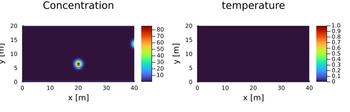
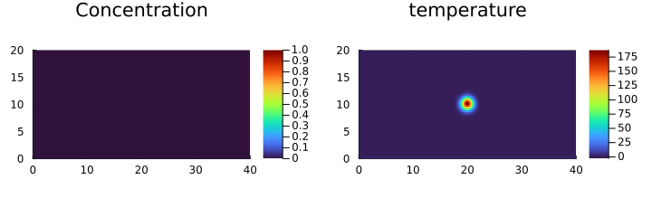
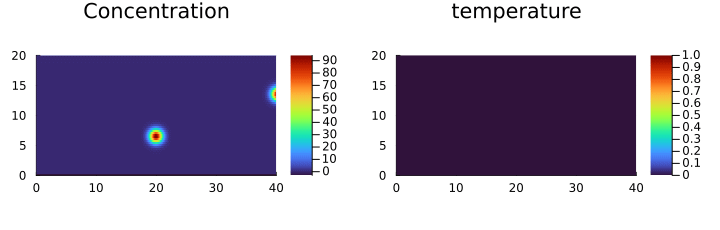

# Final Project

[](https://github.com/saluzf/PDE-on-GPU-FabioSaluz-FinalProject/actions/workflows/CI.yml)


## Probelm Description

Four increasingly difficult problems are solved all based on porous convection. Each new problem introduces one additional chemical or physical problem. 
The start for the analysis is  built upon the previously build [porous convection solver](https://github.com/saluzf/pde-on-gpu-Fabio-Saluz), designed in the first project. The isothermal saline aquifier is an alternative approach to the porous convection. The underlying darcy flux formulation and the density can be written dependent on the concentration instead of temperature.  

Both the isothermal saline aquifier and the thermal porous convection solver are then combined to a saline aquifier where both temperature and concentration changes are considered. The temperature is more the driving force of the flow dragging along the concentration.  

Finaly the reactive saline aquifier is the final and most advanced version of the [porous convection solver](https://github.com/saluzf/pde-on-gpu-Fabio-Saluz). Additionaly to the saline aquifier setup a reactive term is included. It simulates the dissolution of SiO2 out of calcium into an aqueous solution. Intialy there is no SiO2 in the fluid. The reaction is temperature dependent and warm streams increase the amount of SiO2 that dissolves into the fluid while the cold stream decreases it. Higher temperatures increase the reaction and the salt concentration increases. Increasesed salt concentration leads to higher density countering the lower density caused by the increased temperature. The concentration profile evolves based on the hot and cold streams. The transport of the species becomes a dominating factor for the salt dissolution process. The dissolution reaction is very slow. This allows to neglect influences of the reactions on the temperature and to assume the porosity to be unafected by the reaction process.  

The following two movies show the solution of the project for one single contour level of the temperature and the concentration.


*Figure 1: 3D movie of a single Concentration Contour level of the reactive saline Aquifier solved with the presented code.*  


*Figure 2: 3D movie of a single Temperature Contour level of the reactive saline Aquifier solved with the presented code.*  

## Methods 

### Physics and Numerics

The continuity equation for the saline aquifier reads as shown in equation 1. With the porosity $\theta$ and the velocity vector $v$ 

  

We define the product of the porosity and the velocity as the darcy flux and express it as a function of   
  
  

By plugging in the Darcy's flux expression in the continuity equation we obtain: 
  
  
  
Density formulation for both temperature and concentration for aqueous solution as in equation 4: We consider fluid and dissolved salt = 2 species. Formulation from Chapter 5.4 in Bortoli, De AL, Greice Andreis, and Felipe Pereira. Modeling and simulation of reactive flows. Elsevier, 2015.
High salt concentration in the aqueous solution increases the density of the fluid while high temperature decreases the density. Therefore the thermal expansion coefficient is usually positive while the concentraiton expansion coefficient is negative. 

   
  
By solving for 1 concentration one obtains the other from mass conservation. With
the mass fraction balance for 2 species 1 = y1 + y2 and y = C·MW where y is
the mass fraction and MW the molecular weight we obtain equation 5. It was not possible to find experimental volumetric expansion coefficients. Therefore the coefficient was assumed to be the negativ thermal expansion coefficient. For some simulations it was either multiplied or divided by ten to get a better understanding of the effects. For the isothermal it was -1.0 for the standard saline aquifier it was -0.1 and for the reactive it was -10.0. The negative sign causes the density to increase for larger concentration. Only salt concentration changes were considered for the simulation. $\beta_2$ was assumed to be 0.

  

By plugging in the density formulation in equation 4 into the darcy flux formulation of equation 2 we obtain equation 6 now depending on both concentration and temperature. 

  

The dissolution of salt from the solid is a very slow reaction. Therefore the heat produced is very low and neglected for the current analysis. This allows to reuse the energy balance derived in the porous convection project. We solve for changes of the temperature and concentration from a reference value and not the absolutes.

  

We can formulate the concentration transport equation based on advection diffusion and a potential reactive term. As the temperature PDE it consists of both an advection and diffusion term. This allows to use the same solver approach as developed for the temperature equation.

  

Combining all the equations yields equation 9. 

  

As in the porous convection project the system of equation is solved with a pseudo transient method. Each system is expanded by a pseudo physical term depending on the pseudo time $\tau$.

  


### Chemistry  

For simplicity the fluid is assumed to be an dissolved solution of SiO2. The solid consists of mineral quartz and dissolves slowly into the fluid according to SiO2(s) <=> SiO2(aq). The reaction constants are taken from: Chapter 5.4 in Bortoli, De AL, Greice Andreis, and Felipe Pereira. Modeling and simulation of reactive flows. Elsevier, 2015. They found log(k)=-13.4 and Ea=90.4kJ/mol. The reaction rate constant follows the Arrhenius law. A simpler linear model was considered first but the nonlinearity of the Arhenius law was found to introduce no difficulties for the solver. The chemistry is not added to the concentration transport equation. An operator split is applied and the temperature and concentration in each time step is solved first and the reaction rate is computed afterwards. 

### Computations  

The simulations where performed on the [Piz Daint Supercomputer at ETHZ](https://www.cscs.ch/computers/piz-daint) using 4 Nvidia P100 16GB PCIe GPU for each simulation. The following script depicts the settings used for the batch job:
```
#!/bin/bash -l
#SBATCH --job-name="diff2D"
#SBATCH --output=diff2D.%j.o
#SBATCH --error=diff2D.%j.e
#SBATCH --time=08:00:00
#SBATCH --nodes=4
#SBATCH --ntasks-per-node=1
#SBATCH --partition=normal
#SBATCH --constraint=gpu
#SBATCH --account class04


module load daint-gpu
module load Julia/1.9.3-CrayGNU-21.09-cuda


export MPICH_RDMA_ENABLED_CUDA=0
export IGG_CUDAAWARE_MPI=0

srun -n4 bash -c 'LD_PRELOAD="/usr/lib64/libcuda.so:/usr/local/cuda/lib64/libcudart.so" julia --project -O3 --check-bounds=no ReactiveSalineAquifier_3D_multixpu.jl'
```


The 3D domain was discretized into 252x124x63 cells and solved for 2000 time steps. 

### Initial and Boundary Conditions

The initial conditions are presented below. 

  
*Figure 3: Initial conditions for the isothermal Saline Aquifier.*  

  
*Figure 4: Initial conditions for the Saline Aquifier.*  


  
*Figure 5: Initial conditions for the reactive Saline Aquifier.*  

For each simulation the x and y representing the side of the rectangular 3D domain are assumed to be Neumann boundary conditions. The top and the bottom or the z boundary conditions are usuall Dirichlet except for the Non-Isothermal saline aquifier where they are Neumann as well.

## Results

## Isothermal Saline Aquifier
 
The underlying code can be found in [Isothermal Saline Aquifier](src/IsothermalSalineAquifier_3D_multixpu.jl). The isothermal saline aquifier assumes constant temperature in the whole domain. Changes in the density arise only from concentration changes. We can clearly see that large concentration increase the fluid density and cause downward convection. 

  
*Figure 6: Isothermal saline aquifier results presented as a movie. Left: Concentration, Right: Temperature.*  

## Non-Isothermal Saline Aquifier

The underlying code can be found in [Non-Isothermal Saline Aquifier](src/SalineAquifier_3D_multixpu.jl). Instead of only considering temperature influences on the porous transport I now added a concentration dependence. Darcy's law which was used to approximate the porous flow and to compute the density can be expanded by a concentration dependance according to equation (1). The temperature profile including initial and boundary conditions from the porous convection solver remains the same. The concentration intials conditions are selected similarly for simplicty. In the beginning the concentration is 0 everywhere except for two hotspots. The hotspots are not in the same position as the temperature intial hotspot. 
 
 The same intial and boundary conditions was simulated 3 times for different volumetric expansion coefficients of the fluid:
 
 The first solution was obtained for $\alpha=10\beta$ The rising warm and the sinking cold fluid dominate the transport of the concentrations and drag along the concentrations. Nevertheless if there is no temperature gradient one can clearly see patches of increased concentration to get advected downwards. 

  
*Figure 7: Non-Isothermal saline aquifier results presented as a movie. Left: Concentration, Right: Temperature.*

## Reactive Saline Aquifier

The underlying code can be found in [Reactive Saline Aquifier](src/ReactiveSalineAquifier_3D_multixpu.jl). In a final step the reaction is added to the system. One can clearly see that the temperature is dominating the density changes. The reaction rate is too small to have a significant effect. Therefore temperature is the driving force for the reaction. Because of the temperature dependence of the rection hot streams cause more salt to be edged out into the fluid. Contrary to the two previous examples one can clearly see that the concentration increases. The current code is more of a prove of concept and lacks extensive physical parameters for an exact system. For the future it would be crucial to compare the solver against a real physical system and validate the code with experimental data. Nevertheless we could show the underlying physical and chemical effects and the current state of the solver allows to explore the different physical domains and the interplay between them. 

  
*Figure 8: Reactive saline aquifier results presented as a movie. Left: Concentration, Right: Temperature.*
  
  
*Figure 9: Reactive saline aquifier results presented as a movie. The movie plots several contour lines.*

## Literature

1. Bortoli, De AL, Greice Andreis, and Felipe Pereira. Modeling and simulation of reactive flows. Elsevier, 2015.


2. Susan L. Brantley James D. Kubicki Art F. White. Kinetics of Water-Rock Interaction. Springer, 2008.


3. Ludovic Räss,   Mauro Werder,   Samuel Omlin & Ivan Utkin, Fall 2023, [PDE on GPU Course-Webpage](https://pde-on-gpu.vaw.ethz.ch), last accessed: 16.01.2024, (https://pde-on-gpu.vaw.ethz.ch).

4. Leandro de Paulo Ferreira, Thomas David Serafini de Oliveira, Rodrigo Surmas, Mônica Antunes Pereira da Silva, Ricardo Pires Peçanha,Brinkman equation in reactive flow: Contribution of each term in carbonate acidification simulations, Advances in Water Resources, 2020.